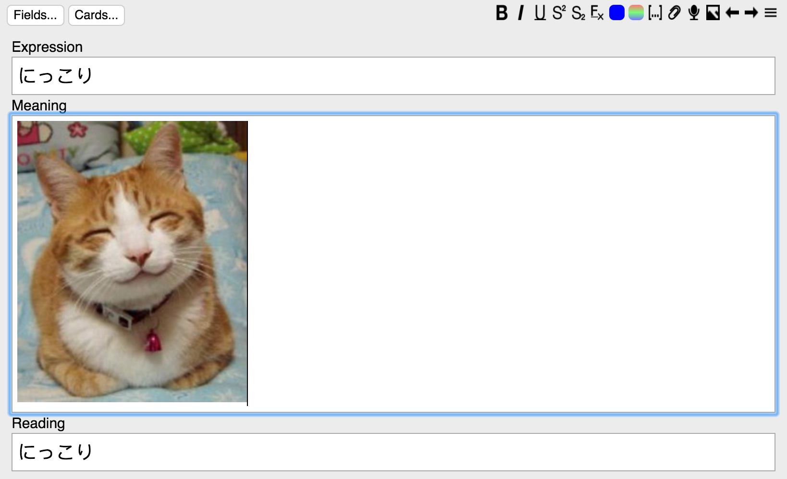

# Anki Image Search
Basically scraps Google Images and places them on your card. This only works for Anki 2.1.

You should follow the instructions [here](https://ankiweb.net/shared/info/885589449) for installation.

## How
On the card editor (from either the "Add" or "Browse" dialog), there are three buttons added right before the **More** button on the upper right portion of the editor: **Search Image**, **Previous Image** and **Next Image**.

Basically just type in your search term in the first field of the card, and use those buttons. The image will be inserted/updated in the second field.

If you are unfortunate enough to, say, live in China and have no access to Google, go to Tools -> Image Search -> Network Config, and set your proxy settings. Note that this is a global setting that will affect all calls to urlopen(), even if they are from Anki itself or other Anki plugins, although if you have restricted Internet access you probably need it anyway. (TBH this should be an entirely separate plugin, or just be integrated into Anki itself, but whatever).

If you are encountering certificate errors when retrieving images, and you are on a *trusted* network, go to Tools -> Image Search -> Network Config, and check the box "Bypass HTTPS Verification".

You can track the project [here](https://github.com/haoxuany/anki_image_search).

## License

None of this would be possible without Google Images. Even though technically I'm scrapping Google Images, here's the Powered by Google logo that's used in the Search API:

I obviously own nothing from Google.

The icons are provided by [Open Iconic](https://useiconic.com/open). Open Iconic is licensed under MIT.

This project is under [GPLv2](./LICENSE).

## Why
As with every project that I work on my own, it's something that I really want, and for whatever reason no one else wrote it. So now I have to do it myself and go through the pain of using Python. :frowning: I would've gladly chosen ML, even Haskell, or even other slightly less crappy language like C, but FFI through Python is a ridiculous pain and I really tried, (and Anki places restrictions on packages involved), so when I wrote this I just close my eyes and pretend I'm a compiler for a less shitty language. This is a 1 1/2 week project, so it's buggy, and it's Python, but works fine for me so far, so whatever.

The main reason I want it is that I'm trying really hard to learn Japanese right now, and I know just how important it is to be able to point at pictures and recall words without going through a translation phase. I got annoyed doing it by hand at around 20 cards.

